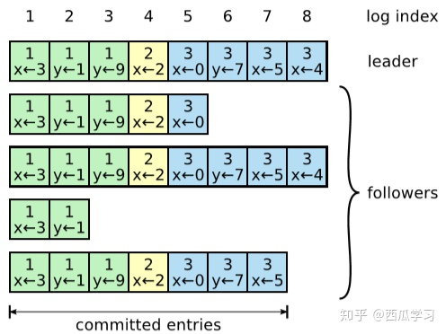

# distributedSystem

# 一致性算法和Raft的特性

**Raft是一种一致性算法，提供了和Paxos相同的效果，一样的效率，但结构上更为简单，易于理解。

**一致性算法**保证一个集群可以协同工作，即使部分机器出现故障或由于网络导致数据就是。

Raft完成了两件事：

- 问题分解
- 状态简化

Raft将一致性问题分解为几个部分，Leader选举，日志同步，安全性，日志压缩，成员变更等。

- Raft拥有更**强**的leader。Log Entries只能从leader流向其它的服务器。
- Leader选举。Raft使用随机数用于选举。
- 成员变更。当集群内的服务器变更时，Raft允许继续执行操作即使集群配置在发生变化。

具有实践意义的一致性算法有如下特点：

- 保证安全性，不会返会错误的信息在非拜占庭条件下，包括网络延迟，数据包丢失，数据分块等，乱序等。

> 当出现故障但不会伪造信息的情况称为**非拜占庭情况**。出现伪造信息，恶意响应的情况称为**拜占庭情况**。区块链下要处理的很多即为拜占庭情况。

- 分布式系统下的集群在一致性算法下具有强大的**容错**能力，只要大多数server可提供服务，其它server的故障不影响整个系统工作，当故障server恢复后重新加入集群工作。
- 不依赖时间机制实现一致性。
- 在多数情况，一个命令可以完成只要大多数server回应了一轮的远程过程调用(RPC)，部分运行缓慢的server不影响系统整体的性能。

## Raft算法

### 一、算法详解

### Raft节点的三种状态：

- Leader

接受客户端请求，并向follower同步请求日志，当大多数节点通知Leader日志同步成功，则Leader提交日志。

- Follower

接受并持久化来自Leader同步的日志，Leader通知可以提交则提交日志。

- Candidate

候选者。Leader选举过程中出现的临时角色。

**从状态转移图中可以看出**

- 开始所有节点都处于follower状态，在一段时间内**没有收到来自Leader的心跳包**，切换到candidate状态。
- 出现times out(比如心跳包丢失等情况)，发起选举，如果获得**来自多数server的投票**，则称为leader，如果别的server称为Leader，则返回Follower状态。

**选举任期**

- Raft将时间分为任意长度的任期(term)。一个任期从一个选举开始。注意图中的t3，此时由于**平票等原因没有产生Leader**，则重新开始一个新的选举产生term4.
- 使用时间的一致性机制显然是不合理的。故server可能仍然处于旧的任期(term)下，即使全局的Leader已经更新。如果server发现其term以过失，则更新到最新的term。而一个来自过时term的请求会被server拒绝。

### Raft中的RPC

server之间通过RPC进行沟通。Raft下总共有三种RPC，经常使用的有两种。

- RequestVote RPC

在选举期间由candidate节点发起。

- AppendEntries RPC

在任期内由Leader发起，将日志项(log entries)发送给follower用于同步，同时也用于Leader向Follower发送心跳包用于保证Leader合法性。

- SnapShoot RPC

在传输节点快照(Snapshot)时使用。

### Leader选举(leader election)

所有分布式节点初始化为**follower**，当选举出的Leader发送心跳包(AppendEntries不包含实际log entry)，则follower认为leader有效。当follower**超时**(election timeout)任然未收到心跳包，则认为leader失效，需要**重新选举**。

一个follower成为candidate，并行的向所有其它servers发起RequestVote RPC请求。candidate保持在该状态直到：

- 该candidate成功成为leader

当candidate获得了大多数的选票，则成为leader。每一个server，包括candidate本身，**至多给一个candidate投票，且投票给第一个来自candidate的RPC请求**，**即先来先得的原则**。

> 该机制保证了选举的安全性，即一个任期term至多只有一个leader被选出。

当某一server成为leader后，会向所有其它servers发送心跳包，告知其leader以选出。

- 另一个server成为了leader，则其回退到follower状态

当server接收到来自一个被选出leader的心跳包，且其任期term大于等于该server当前的任期，则认为该leader为合法的。

- 在有限时间内，整个系统没有任何一个节点成为leader，比如出现**平票**，则等到timeout后，退出candidate状态，等待发起下一次选举。

> 要注意的是，当没有相应的措施，下一次选举仍然会出现平票的情况。Raft采取Randomized election timeouts保证平票发生概率很低，即每个server**选举超时时间**是随机的，尽可能避免了平票的发生。

### 日志同步(log replicate)

当一个Leader被选举，它便开始响应客户端请求。当leader接受到一个客户端的指令，将**请求**作为日志条目加入日志中，同时并行的向所有follower发起AppendENtries RPC，请求follower**同步该日志条目**。要注意的是，所有**并发请求的执行顺序**都由leader决定。当leader认为日志已经**“安全的同步到follower”**中时，则执行条目修改leader的数据状态，通知client提交成功。

如果有一个follower由于故障或网络没有按时回复同步消息，则leader会**无限**的发起RPC直到成功同步该消息。

从下图中可以看出，每一个日志条目(log entry)至少包括要同步的命令及该日志条目生成的任期term编号。term的编号被用于寻找不同server日志的不一致。

leader会在认为**“安全”**的时候提交(committed)日志到该状态机，即存储设备。Raft保证所有被提交的日志条目都是持久的，安全。**注意**，这里才是日志真正被提交，之前的仅仅为**请求**。而Raft认为一个日志条目被大多数follower同步后，即认为“安全”。同时，**要提交所有之前的日志条目，包括之前leader创建的日志条目**。

> 观察上图log index为7的日志条目，其被大多数followers同步，视其为可提交。

以上操作保证了在不同server的一致(coherency)：

- 如果不同日志中的两个日志条目有相同的索引和任期编号，则认为二者的命令是相同的。

> 根据leader在一个任期内在一个特定的log index下创建有且只有一条日志条目，同时该条目位置不会改变。

- 如果不同日志中的两个日志条目有相同的索引和任期编号，则它们之前的所有条目都是完全相同的。

> 由 AppendEntries 的一个简单的一致性检查保证。当发送一个 AppendEntries RPC 时，leader会把新日志条目**之前的日志条目的log index和term**信息包含在其中。如果follower没有在它的日志中找到之前的log index和term index都相同的日志条目，则**拒绝新的日志条目请求**。

正常情况下 AppendEntries的一致性检查不会失败。然而，leader节点的崩溃可能会导致日志不一致：旧的leader可能没有完全复制日志中的所有条目。

上图阐释了follower的日志可能与新的leader不一致。follower可能丢失当前leader拥有的日志，或拥有当前leader所不具有的日志，如上图的**c与d** followers，c多了一个term index为6的日志，d多了两个term index为7的日志。

在Raft下，leader通过**强制followers复制它的日志**来处理日志的不一致，不一致的日志会被**强制覆盖**。follower首先找到**最近(时间域)的一条日志条目**，该日志条目在leader和follower的日志中为一致的。然后**删除**follower上该日志条目所有日志，然后用leader的日志**覆盖**。

> 在实际操作中，一致性检查发生在AppendEntries RPC被发起。当一个新的leader“掌权”，其会将下一个log index作为**nextIndex**。如上图的11号log index。**每一个follower对应一个nextIndex**。当AppendEntries被拒绝，nextIndex递减再发起请求，直到找到二者达成一致的节点。

该协议可以帮助减少被拒绝的AppendEntries，提高效率。而对于一个新的leader，其不需要额外的保存一致性。

> 以上所说的将日志匹配同步(log matching)的特性也是Raft算法需要保证的安全特性。

**注意Raft的日志修改和server状态(可以理解为数据库中的数据修改)是不同的**

首先client发起请求，leader生成命令，发送日志同步RPC到follower中。**leader此时的状态并没有改变**，因为还没有**提交(commit)**，只是有了日志。当多数follower同步日志成功，leader提交日志，才会**改变自己server的状态**。在leader提交之前，**follower也只是同步日志，并没有改变server状态**。提交之后，leader通知其它follower提交成功，**follower才会修改自己server的状态**。

### 二、Raft的安全性

以上讨论的关于Raft选举制度和日志同步并不足以让我们充分信任Raft的一致性结果。我们仍需加入一些**限制性规则**以保证分布式系统的一致性。

### 选举限制(Election restriction)

Raft需要保证拥有**最新的已提交日志条目**的follower才能被选举为leader。

> 该点是Raft需要保证的**安全特性**，其保证了leader从不会覆盖或删除自己server内的日志。

选举限制是由RequestVote RPC实现的。当candidate发送RequestVote RPC时，会包含其**最后一条日志的term编号以及log index**。followers接收到请求后，如果自己的日志更新，则**拒绝投票请求**。

日志比较原则：term编号大的更新；如果term编号一样大，则log index更大的更新。

### 限制提交先前任期的日志条目 (committing entries from previous terms)

首先我们来看一个潜在的问题：

- 在(a)中，S1当选为leader，同步任期编号为2的日志到S2中。
- (b)中，S1由于故障崩溃离线，在任期编号为3中选举S5为新的leader。
- (c)中，S5作为leader后立刻奔溃，还未发送任何同步日志请求。S1恢复并当选为leader，继续日志同步。此时**多数follower**已经同步了来自S1的日志，可以**提交**。
- (d)中，S1再次奔溃离线，S5可以被选举为leader，因为其有**最新的日志**，符合上述安全特性。故其覆盖了其它follower的日志。

上述过程出现了日志的覆盖丢失。此时我们需要加一些限制保证Raft的安全性。究其原因，**(c)中的任期4提交了之前任期2的日志**，这种情况应该被杜绝。

Raft认为，之前任期的日志条目**不应该根据多数follower同步原则提交**，而应该等到有一个当前任期的日志条目提交时，之前任期的日志条目再一起提交。

- 上图(e)中，log index为2，term为2的日志条目已被大多数节点同步确认，但根据限制，**不能提交**。只有当当前任期4，即log index为3， term为4的日志条目可以提交时，之前任期，即任期编号为2的日志条目，才可以被提交。此时即使S1离线，也不会出现日志丢失。

### 状态机安全特性(state machine safety property)

以上所说的**选举限制**和**限制提交先前任期的日志条目**保证了Raft的**Leader完整性**特性(Leader Completeness)。Leader的完整性特性即保证了**状态机安全**，论文中有证明。此处的状态机，我的理解即为server上的数据状态，比如数据库的状态。

当一个server应用(执行)了一个日志条目在一个特定的index下，其它的server不会在该相同的index下应用不同的日志条目。

下图为Raft对其保证的安全特性的总结

### follower和candidate的崩溃

以上讨论的都是保证leader崩溃的安全性。而follower和candidate的崩溃处理会更为简单。

- 当崩溃后，**RequestVote和AppendEntries**都会失败，Raft会无限重试请求
- 当server从崩溃中恢复，RPC成功。
- 若server成功接受RPC但在**响应前**奔溃，则它会重新接受新的RPC在恢复之后。
- Raft中的RPC是**幂等**的。

### Raft的时间和可用性

Raft的安全特性不应该依赖于时间，但可用性(availability: 系统即使相应客户的能力)依赖于时间。Leader选举是Raft中对时间有要求的，帮助处理server崩溃等情况。有下式：

**broadcastTime ≪ electionTimeout ≪ MTBF** 

- broadcastTime为并行发送RPC并接受响应的平均时间，0.5ms-20ms.
- MTBF为平均无故障工作时间。良好的分布式系统可以长达几个月。
- electionTimeout即为前面所述的随机投票超时时间，10ms-500ms.

### **三、成员变更(cluster membership changes)**

以上所有讨论的情形都是在分布式系统的组成(configuration, 即参与一致性的servers)是不变得。但在真实条件下，分布式系统的成员会发生变化。

显然，将所有servers离线再变更显然不是一个好方法，同时直接从一个configuration切换到另一个configuration显然是不安全的。Raft采用了**joint consensus**机制，将整个更新阶段分为两个阶段。

**第一阶段切换到过度的joint consensus configuration下**，当joint consensus被提交后，**在第二阶段切换到新的configuration下**。joint consensus同时拥有新，旧两种configuration。

- 上图由三个server切换到 五个servers。集群会分割出两个独立的多数群体(超过半数)

根据上图，我们可以总结Raft的两阶段成员变更过程：

1. leader接收到成员变更请求，从 切换成，计算二者**并集**，得到。
2. 将作为日志条目，使用RPC同步到其它server中。当server接受到该消息，即通知集群的配置(configuration)发生了改变，更新自己的日志，就**将作为自己所看到的集群配置**，无论该配置是否提交。
3. 如果和都收到了大多数的日志更新响应确认，则leader提交该日志条目。
4. leader生成一个新的日志条目，其内容为新的成员配置。写入leader的日志并请求同步到followers中。
5. follower收到RPC后，将加入日志，发送应答。
6. 当leader收到的应答数满足大多数原则，则提交包含的日志条目，之后**不在中的节点会下线**，上图中的红色箭头即为该操作。
7. 上线，成员变更成功。

### **成员变更的特殊情况**

- 对于一个新加入的server，其**“追上”**leader的日志需要很长的时间，存在加大的服务停顿期。故在configuration改变之前，新的server可以参与日志同步，但**不能参与投票**，当完成日志匹配(log matching)，再执行成员变更。
- leader不一定是的一部分，即当前leader可能被下线。leader会在包含的日志被提交后下线。因为该时刻是真正可以独立执行操作，leader作为的下线。
- 的下线导致重复选举。移除的server在接受不大新的leader的心跳包后，会触发选举超时，开始新的选举，导致原先的leader变为follower。所以，Raft会拒绝RequestVote RPC当server确信此时有一个leader存在。
  当一台server接受到的RequestVote RPC和leader发的心跳包时间间隔小于最小electionTimeout，则拒绝该投票。

### **四、日志压缩(log compaction)**

在实际环境下，日志不能无限制的增长，否则会使得server应答缓慢，服务效率降低。Raft采取有效的**SnapShotting**的办法。

### **Snaphot**

每一个server独立的执行snapshot，只覆盖所有已提交的日志条目。

如图，Snapshot内包含两部分。

- 元数据(metadata)，用于一致性检查
  last included index：最后一条以提交日志条目的log index
  last included term：最后一条以提交日志条目的任期编号(term index)
- server当前状态

server完成快照的写入，server可以删除最后包含的索引中的所有日志条目，以及任何之前的快照。同时，在大多数情况snapshot由follower发送给leader，但如果follower发生奔溃等情况，**leader也需要将snapshot发送给follower**。

**为什么不直接在leader产生日志快照，然后发送给follwer？**

- 每个follower独立生成快照可以减少带宽使用，降低leader设计的复杂度。

### **snapshot的传送**

当**follower太落后于leader**时，leader会向follower发送snapshot。分布式系统使用InstallSnapshot RPC来传输。

- follower的日志不包括snapshot中的日志信息或follower的日志与snapshot中的日志发生冲突，直接将follower中的日志替换为snapshot中的。
- follower的日志多于snapshot中的日志。保留snapshot之后的日志，替换server中对应snapshot的部分。

### **探讨Raft的snapshot**

- 如果snapshot太频繁，会占据磁盘的大量带宽，降低服务效率。如果snapshot太不频繁，日志会耗尽磁盘存储空间，增大了日志匹配的时间。
  **采取日志大小达到某一个阈值时进行一次snapshot。**
- 写入snapshot需要大量的时间。
  **采用copy-on-write技术**。接受新的更新但不影响快照写入。

### 可视化

http://thesecretlivesofdata.com/raft/
